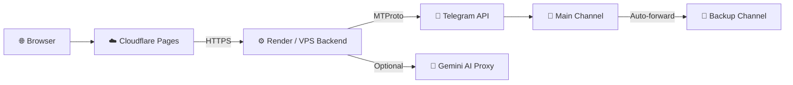
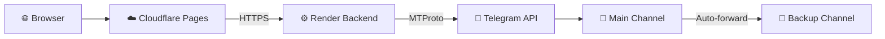

<div align="center">

# 🚀 Telegram Drive

### 🗂️ Turn Your Telegram Account Into Unlimited Cloud Storage

[](https://opensource.org/licenses/MIT)
[](https://github.com)
[](https://www.rust-lang.org)
[](https://react.dev)
[](https://core.telegram.org/api)

</div>

---

## 🌟 Why Telegram Drive?

Telegram offers **unlimited free cloud storage** — but using it as a real drive is painful. This project bridges that gap with a polished, self-hosted interface backed by a high-performance Rust relay.

| 🎯 Benefit | 💬 What It Means For You |
|-----------|------------------------|
| 💰 **100% Free Storage** | Telegram does not cap file storage. Your channels become unlimited disk space. |
| 🌐 **Access Anywhere** | Web app runs on phones, tablets, laptops — any modern browser. |
| 📦 **5 GB+ Files** | Upload massive files with automatic chunked streaming — no manual splitting. |
| 🔄 **Auto Backup** | Every upload is instantly forwarded to a backup channel. Your files survive account issues. |
| 🔓 **No Vendor Lock-in** | Your files live in YOUR Telegram channels. Export anytime without restrictions. |
| 🏠 **Fully Self-Hosted** | Backend runs on Render, Railway, Fly.io, or any VPS. You control the data path. |
| ⚡ **Lightning Fast** | Rust backend handles concurrent uploads/downloads with minimal overhead. |
| 🔒 **Privacy First** | Files go directly from your browser to Telegram through your relay — no middleman storage. |

---

## 🏗️ Architecture Overview



### 🔄 Request Flow

1. 📁 **Setup** — Create a Telegram channel (or use Saved Messages)
2. 🔐 **Auth** — Sign in with your Telegram account via MTProto
3. ⬆️ **Upload** — Drag & drop files → browser streams chunks → Rust backend → Telegram
4. 🔍 **Browse** — Tree view, search, filters, tags, favorites, recent files
5. 🎬 **Preview/Stream** — Play video/audio, view images, preview docs/slides/sheets inline
6. 🔄 **Backup** — Every file is auto-forwarded to your backup channel automatically

---

## ⚖️ Desktop vs Web — Which Should You Choose?

| Feature | 🖥️ Desktop (`app/`) | 🌐 Web (`web/`) |
|---------|---------------------|-----------------|
| **Stack** | Tauri + Rust + React | React + Vite + Rust (Actix-web) |
| **Install** | Native installers (`.msi`, `.dmg`, `.deb`) | Open browser at your domain |
| **Upload Limit** | System RAM | Up to **5 GB** with chunked streaming |
| **Auto Backup** | ❌ | ✅ Auto-forward to backup channel |
| **Access** | Single machine | Any device with a browser |
| **Keep-alive** | ❌ | ✅ Self-ping + GitHub Actions cron |
| **Tests** | ❌ | ✅ 13 backend + 36 frontend tests |
| **Deploy** | GitHub Releases | Cloudflare Pages + Render |

> 💡 **Recommendation:** Use **Web** for the full feature set, cross-device access, and production deployment. Use **Desktop** if you want a native app experience on a single machine.

---

## 🛠️ Technology Choices & Justifications

### 🦀 Rust Backend — Why Rust?

| Decision | Justification |
|---------|--------------|
| **Actix-web** | High-performance, production-grade async web framework with excellent ecosystem |
| **Telethon** | Mature Python MTProto library that bridges Rust ↔ Telegram via FFI/subprocess |
| **SQLite** | Zero-config, file-based storage for sessions and metadata — perfect for self-hosted deployments |
| **Docker** | Consistent deployment across Render, Railway, Fly.io — "build once, run anywhere" |
| **Streaming I/O** | Handles 5 GB+ files without loading entire file into memory — critical for large uploads |

### ⚛️ React Frontend — Why React + Vite?

| Decision | Justification |
|---------|--------------|
| **React 18** | Component model ideal for complex file-management UIs with drag/drop, modals, and tree views |
| **Vite** | Lightning-fast HMR during development, optimized production builds |
| **TailwindCSS** | Utility-first CSS for rapid, consistent UI development without massive stylesheets |
| **Vitest** | Blazing-fast unit tests with native ESM support and React integration |
| **TypeScript** | Strict typing catches bugs at compile time — critical for a complex file-management app |
| **Tiptap** | Rich text editor for in-browser document editing (`.docx` export) |
| **PapaParse / SheetJS** | Client-side CSV and spreadsheet parsing/rendering without server round-trips |

### 🖥️ Tauri Desktop — Why Tauri?

| Decision | Justification |
|---------|--------------|
| **Tauri v2** | Rust-based desktop shell — tiny bundle size (~3 MB) vs Electron (~100+ MB) |
| **Shared Rust core** | Backend logic can be reused between web server and desktop app |
| **OS-native webview** | Uses system WebView on Windows/macOS/Linux — better performance and OS integration |

---

## ⚡ Web App Quick Start

### 🔧 Backend

```bash
cd web/backend
cp .env.example .env    # fill in your Telegram API credentials
cargo run --release
```

**Why separate backend?**  
The Rust backend handles MTProto connections, file streaming, and Telegram API interactions. Keeping it separate allows:
- Independent scaling of API layer
- Secure credential management outside the browser
- Efficient binary file streaming (browsers can't do raw MTProto)

### 🎨 Frontend

```bash
cd web/frontend
npm install
npm run dev
```

> 💡 Frontend runs at `http://localhost:5173` with API proxy to `http://localhost:8080`.

**Why Vite proxy?**  
The Vite dev server proxies `/api` to the Rust backend. This avoids CORS issues during development and mirrors the production setup where Cloudflare Pages serves the frontend and Render hosts the backend.

---

## 💻 Desktop App Quick Start

**Prerequisites:** Node.js v18+, Rust latest stable, OS build tools ([Tauri prerequisites](https://v2.tauri.app/start/prerequisites/))

```bash
git clone https://github.com/Sathyamoorthy143/Telegram-Drive-Desktop.git
cd Telegram-Drive-Desktop/app
npm install
npm run tauri dev
```

> 💡 **Tip:** Temporarily disable Two-Step Verification during initial setup for faster login. Re-enable after.

---

## 🔄 How It Works



1. 📁 **Create a Telegram channel** (or use Saved Messages)
2. 🔐 **Sign in** with your Telegram account via secure MTProto
3. ⬆️ **Upload files** from browser → directly to Telegram via Rust backend
4. 🔍 **Browse, search, preview, stream** files in the intuitive UI
5. 🔄 **Auto-backup** — every upload is automatically forwarded to your backup channel

---

## 🚀 Production Deployment

### ☁️ Frontend → Cloudflare Pages

**Why Cloudflare Pages?**  
- Global CDN with edge caching — sub-second load times worldwide
- Free tier with unlimited bandwidth
- Native Git integration — auto-deploy on push
- Wrangler CLI for seamless deployment

```bash
cd web/frontend
VITE_API_URL=https://api.yourdomain.com npm run build
npx wrangler pages deploy dist --project-name=telegram-drive
```

**Environment Variables:**
- Set `VITE_API_URL` to your Render backend URL in Cloudflare Pages dashboard

---

### 🖥️ Backend → Render

**Why Render?**  
- Free tier with 750 hours/month — enough for 24/7 personal use
- Docker support with auto-deploy from GitHub
- Built-in HTTPS and custom domain support
- Persistent disk option for session survival across deploys

#### Option A: Render IaC (Recommended)

Place `render.yaml` at your **repo root**:

```yaml
services:
  - type: web
    name: telegram-drive-backend
    plan: free
    runtime: docker
    rootDir: web/backend
    dockerfilePath: ./Dockerfile
    healthCheckPath: /api/check-connection
    autoDeploy: true
    branch: main
    envVars:
      - key: TG_API_ID
        sync: false
      - key: TG_API_HASH
        sync: false
      - key: RUST_LOG
        value: info
      - key: DOMAIN
        value: your-app.onrender.com
      - key: SESSION_PATH
        value: telegram.session
      - key: SETTINGS_PATH
        value: settings.json
```

> ⚠️ **Important:** The root `render.yaml` uses `rootDir: web/backend`. If your GitHub repo root is already `web/`, use `web/render.yaml` instead (without `rootDir`).

#### Option B: Manual Setup

1. 📤 Push to GitHub
2. ➕ In Render, create a **Web Service** using `web/backend/Dockerfile`
3. 🔑 Set environment variables (see `web/backend/.env.example`)
4. 💾 Attach a **persistent disk at `/app/data`** for session storage (optional but recommended)

---

### 🔗 Domain Setup

1. Add an **A record** pointing to your backend server
2. Configure **CORS** in the backend (already set to allow any origin)
3. Set `DOMAIN` env var on the backend to your domain (e.g., `api.yourdomain.com`)

---

## 📋 Environment Variables

| Variable | Description | Default | Required |
|----------|-------------|---------|----------|
| `TG_API_ID` | Telegram API ID from https://my.telegram.org | — | ✅ |
| `TG_API_HASH` | Telegram API Hash from https://my.telegram.org | — | ✅ |
| `PORT` | Server port | `8080` | ❌ |
| `SESSION_PATH` | SQLite session file path | `telegram.session` | ❌ |
| `SETTINGS_PATH` | Settings JSON file path | `settings.json` | ❌ |
| `FRONTEND_DIST` | Path to built frontend | `../frontend/dist` | ❌ |
| `AI_PROXY_URL` | Gemini AI proxy URL | — | ❌ |
| `DOMAIN` | Public domain for streaming URLs | `localhost:8080` | ❌ |
| `RUST_LOG` | Log level (`error`, `warn`, `info`, `debug`, `trace`) | `info` | ❌ |

---

## 📡 API Endpoints

| Method | Path | Description |
|--------|------|-------------|
| **Auth** |||
| `POST` | `/api/connect` | Initialize Telegram client |
| `GET` | `/api/check-connection` | Check/reconnect connection status |
| `POST` | `/api/auth/request-code` | Send OTP to phone number |
| `POST` | `/api/auth/sign-in` | Sign in with OTP code |
| `POST` | `/api/auth/check-password` | Submit 2FA password |
| `GET` | `/api/auth/user-info` | Get current user info |
| `POST` | `/api/auth/logout` | Logout and clear session |
| **Files** |||
| `GET` | `/api/files` | List files in folder |
| `POST` | `/api/files/upload` | Upload file (multipart) |
| `GET` | `/api/files/:fid/:mid/download` | Download file |
| `POST` | `/api/files/delete` | Delete file (move to trash) |
| `POST` | `/api/files/move` | Move files between folders |
| `POST` | `/api/files/copy` | Copy files to another folder |
| `GET` | `/api/files/search` | Search files by query |
| **Folders** |||
| `GET` | `/api/folders/scan` | Scan and list folders |
| `POST` | `/api/folders/create` | Create new folder |
| `PUT` | `/api/folders/:id/rename` | Rename folder |
| `DELETE` | `/api/folders/:id/delete` | Delete folder |
| `GET` | `/api/folders/:id/properties` | Get folder properties |
| **Media** |||
| `GET` | `/api/stream/:fid/:mid` | Stream media (video/audio) |
| `GET` | `/api/preview/:fid/:mid` | Preview file content |
| `GET` | `/api/thumbnail/:fid/:mid` | Get file thumbnail |
| **Advanced** |||
| `POST` | `/api/ai/chat` | Gemini AI chat assistant |
| `GET` | `/api/bandwidth` | Bandwidth usage statistics |
| `GET` | `/api/settings` | Get user settings |
| `PUT` | `/api/settings` | Save user settings |
| `GET` | `/api/trash` | List trashed files |
| `POST` | `/api/trash/restore` | Restore file from trash |
| `POST` | `/api/trash/empty` | Permanently delete all trashed files |
| `POST` | `/api/trash/purge` | Purge trash (admin) |
| `GET` | `/api/favorites` | List favorite/starred files |
| `GET` | `/api/recent` | List recently accessed files |
| `POST` | `/api/files/star` | Star/unstar a file |
| `GET` | `/api/tags` | Get all tags |
| `POST` | `/api/tags` | Set tags on files |
| `POST` | `/api/shares` | Create share link |
| `GET` | `/api/shares/:id` | Get share URL |
| `GET` | `/api/versions/:fid/:mid` | Get file version history |
| `POST` | `/api/versions/restore` | Restore previous version |
| `POST` | `/api/versions/record` | Record new version |
| `GET` | `/api/activity` | Get activity log |
| `POST` | `/api/activity/clear` | Clear activity log |

---

## 🗂️ Repository Structure

This repo contains **three build variants** of the same Telegram Drive app, plus an optional AI helper:

| 📁 Path | 🎯 What It Is | 📚 Docs |
|---------|--------------|---------|
| `app/` | 🖥️ **Desktop App** — Tauri shell wrapping a Rust + React client (native installers) | `app/README.md` |
| `web/` | 🌐 **Web App** — canonical split build: `web/frontend` (React+Vite) + `web/backend` (Rust Actix-web) | `web/README.md` |
| `web-server/` | 📦 **All-in-One** — backend in `web-server/src` + client in `web-server/frontend`, served from one binary; deploys to Docker/Render **and** Vercel | `web-server/README.md` |
| `ai_proxy.py` | 🤖 **AI Helper** — standalone Flask proxy to Google Gemini (optional, separate from Rust relays) | `AI_PROXY.md` |
| `screenshots/` | 📸 UI screenshots (login, dashboard, dark mode, playback, …) | — |
| `.github/workflows/` | ⚙️ CI: `main.yml` (auto Tauri release), `release.yml` (manual build/release), `render-keep-alive.yml` (5-min ping) | — |

> ℹ️ **Note:** The desktop (`app/`) and all-in-one (`web-server/`) clients share the same React/Tauri stack and version (`1.1.176`). Pick **one** to build — `web/` is the reference web build, `web-server/` is the consolidated single-binary build.

---

## 🧪 Testing

### Frontend Tests

```bash
cd web/frontend
npm test
```

**What we test:**
- ✅ Type definitions (`types.test.ts`)
- ✅ Utility functions (`utils.test.ts`, `treeUtils.test.ts`)
- ✅ Total: **36 frontend test cases**

### Backend Tests

```bash
cd web/backend
cargo test
```

**What we test:**
- ✅ Security utilities
- ✅ API handlers
- ✅ Session management
- ✅ Total: **13 backend test cases**

---

## 🤝 Contributing

Contributions are welcome! Please feel free to submit a Pull Request.

1. 🍴 Fork the repository
2. 🌿 Create your feature branch (`git checkout -b feature/amazing-feature`)
3. 💾 Commit your changes (`git commit -m 'feat: add amazing feature'`)
4. 📤 Push to the branch (`git push origin feature/amazing-feature`)
5. 🎉 Open a Pull Request

---

## 📝 License

This project is licensed under the **MIT License** — see the [LICENSE](LICENSE) file for details.

---

## 🙏 Acknowledgments

- 📱 **Telegram** — for providing unlimited free storage and the MTProto API
- 🦀 **Rust Community** — for Actix-web, Telethon-rs, and the amazing ecosystem
- ⚛️ **React Team** — for the best UI library in the world
- 🚀 **Render / Cloudflare** — for generous free tiers that make self-hosting accessible

---

<div align="center">

**Made with ❤️ by [Sathyamoorthy143](https://github.com/Sathyamoorthy143)**

[⬆ Back to top](#-telegram-drive)

</div>
