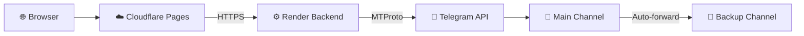

<div align="center">

# 🚀 Telegram Drive

**Turn your Telegram account into a cloud storage drive.**

Upload, manage, and access your files from any browser — no paid storage subscription needed.


</div>

---

## 💡 Why Use This

Telegram gives you **unlimited cloud storage for free**. This project makes it usable as an actual drive:

| Benefit | What It Means |
|---------|---------------|
| 💰 **Free storage** | Telegram does not cap file storage. Use your channels as unlimited disk space. |
| 🌐 **Works anywhere** | The web app runs on phones, tablets, laptops — any browser. |
| 📦 **Large files** | Upload up to **5 GB** per file with automatic chunked streaming. |
| 🔄 **Automatic backup** | Every upload is instantly copied to a backup channel. Your files survive. |
| 🔓 **No vendor lock-in** | Your files are in your own Telegram channels. Export anytime. |
| 🏠 **Self-hosted** | Backend runs on Render or any VPS. Files go directly to Telegram. |

---

## ⚖️ Desktop vs Web

| Feature | 🖥️ Desktop App (`app/`) | 🌐 Web App (`web/`) |
|---------|------------------------|---------------------|
| **Stack** | Tauri + Rust + React | React + Vite + Rust (Actix-web) |
| **Install** | Native installers (.msi, .dmg, .deb) | Open browser at your domain |
| **Upload limit** | System RAM | Up to **5 GB** |
| **Backup** | — | Auto-forward to backup channel |
| **Access** | Single machine | Any device with a browser |
| **Keep-alive** | — | Self-ping + GitHub Actions cron |
| **Tests** | — | 13 backend + 36 frontend |

---

## ⚡ Web App Quick Start

### 🔧 Backend

```bash
cd web/backend
cp .env.example .env    # fill in your Telegram API credentials
cargo run --release
```

### 🎨 Frontend

```bash
cd web/frontend
npm install
npm run dev
```

> 💡 Frontend runs at `http://localhost:5173` and proxies API calls to backend at `http://localhost:8080`.

---

## 💻 Desktop App Quick Start

**Prerequisites:** Node.js v18+, Rust latest stable, OS build tools ([Tauri prerequisites](https://v2.tauri.app/start/prerequisites/))

```bash
git clone https://github.com/Sathyamoorthy143/Telegram-Drive-Desktop.git
cd Telegram-Drive-Desktop/app
npm install
npm run tauri dev
```

> 💡 **Tip:** Temporarily disable Two-Step Verification during initial setup for faster login. Re-enable after.

---

## 🔄 How It Works



1. 📁 Create a Telegram channel (or use Saved Messages)
2. 🔐 Sign in with your Telegram account
3. ⬆️ Upload files from browser → directly to Telegram
4. 🔍 Browse, search, preview, stream files in the UI
5. 🔄 Every upload is automatically forwarded to backup channel

---

## 🚀 Deploy to Production

### ☁️ Frontend to Cloudflare Pages

```bash
cd web/frontend
VITE_API_URL=https://api.yourdomain.com npm run build
npx wrangler pages deploy dist --project-name=telegram-drive
```

### 🖥️ Backend to Render

1. 📤 Push to GitHub
2. ➕ In Render, create a Web Service using `web/backend/Dockerfile`
3. 🔑 Set environment variables (see `web/backend/.env.example`)
4. 💾 Attach a persistent disk at `/app/data` for session storage

> 📖 See `web/README.md` for full deployment details, environment variables, and API reference.

---

## 🗂️ Repository Structure

This repo contains **three build variants** of the same Telegram Drive app, plus an optional AI helper:

| Path | What it is | Docs |
|------|-----------|------|
| `app/` | **Desktop app** — Tauri shell wrapping a Rust + React client (native installers) | `app/README.md` |
| `web/` | **Web app** — canonical split build: `web/frontend` (React+Vite) + `web/backend` (Rust Actix-web) | `web/README.md` |
| `web-server/` | **All-in-one** — backend in `web-server/src` + client in `web-server/frontend`, served from one binary; deploys to Docker/Render **and** Vercel | `web-server/README.md` |
| `ai_proxy.py` | **AI helper** — standalone Flask proxy to Google Gemini (optional, separate from the Rust relays) | `AI_PROXY.md` |
| `screenshots/` | UI screenshots (login, dashboard, dark mode, playback, …) | — |
| `.github/workflows/` | CI: `main.yml` (auto Tauri release), `release.yml` (manual build/release), `render-keep-alive.yml` (5-min ping) | — |

> The desktop (`app/`) and all-in-one (`web-server/`) clients share the same React/Tauri stack and
> version (`1.1.176`). Pick **one** to build — `web/` is the reference web build, `web-server/` is
> the consolidated single-binary build.

## 📝 License

MIT
